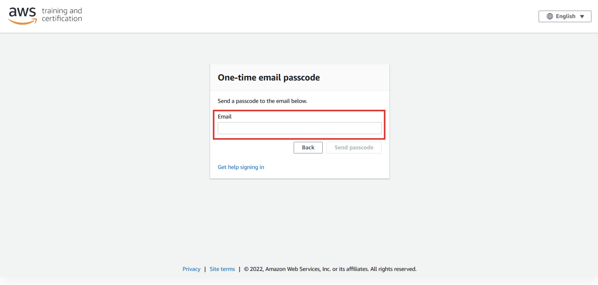
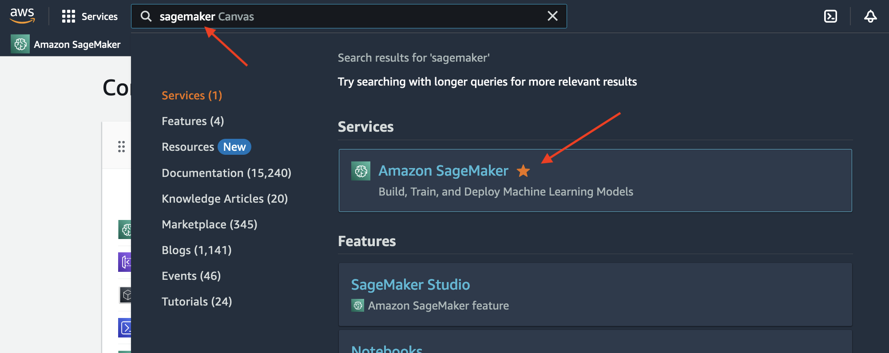

# Complex Reasoning with ReAct using Langchain Agents and Amazon Bedrock 

In this workshop, you will learn how to use multiple different techniques and models to build a ReAct based framework. ReAct is an approach to problem solving with large language models based on 2 main premises: Reasoning and Action. With ReAct, you combine reasoning, through chain-of-thought, with the ability to perform actions through a set of tools. This enables the model to (Re)ason through the input request to determine what steps need to be performed, and uses the available tools to perform (ACT)ions as part of a step-by-step resolution.

More details on ReAct can be found in this research paper: [ReAct: Synergizing Reasoning and Acting in Language Models](https://arxiv.org/abs/2210.03629) and the [Google AI Blog](https://blog.research.google/2022/11/react-synergizing-reasoning-and-acting.html)

## Workshop Environment Setup

Before beginning, you'll need to 1/ open your lab account 2/ setup access to the Amazon Bedrock model's used in this workshop 3/ go into Amazon SageMaker Studio and then clone the github repo that will be used for the remainder of the workshop.   

Please follow the detailed steps below to access your workshop AWS account:

1. To access your lab environment, log in to bit.ly link your instructor provided

2. Click Email One-Time Password (OTP) button.


3. Enter your own email account and click the **Send** passcode button.



4. In your email inbox, check for the email subject "Your one-time passcode email" and copy the passcode. Paste the copied passcode as shown below, then press the **Sign in** button.


5. Enter the 12-character Event Access Code received from the event organizer and click **Next**.


6. Review the Terms and Conditions, scrolling down to click *I agree with the Terms and Conditions*.  Click **Join event** 


7. On the bottom left under **AWS account access**, select **Open AWS console (us-west-2)** 


Please follow the detailed steps below to setup access to the Amazon Bedrock models that will be used for the workshop: 

1. From the AWS console, search for and click on **Amazon Bedrock**, then click **Get started** 

2. From the left menu, scroll down & select **Model access**


3. Click **Manage model access** 


4. You'll be using two models for this workshop so first select **Anthropic - Claude 3 Sonnet**.


5. From the same page, select **Llama 2 Chat 13B**


6. Click **Save changes**

Please follow the detailed steps below to access Amazon SageMaker Studio: 

1. From the AWS console, search for and click on **Amazon SageMaker** 




2. From the Amazon SageMaker console, select **Studio** on the left-hand menu


3. Click **Open Studio** using the pre-populated default user as shown below.  *Note: Your username may be different than the image.*


4. Click **View JupyterLab spaces** 


5. Click **Create JupyterLab space**


6. Enter a name for your space, then click **Create space**


7. Click **Run space**


8.  It will take a few minutes to create your space but once it's ready you'll see the **Open JupyterLab** button.  Click **Open JupyterLab**. 


Clone the github repository that will be used for the workshop: 

1. From inside your JupyterLab environment, open a terminal environment by clicking **Terminal**


2. From the terminal, clone the github repo by copying and pasting the command below inside the terminal session

```git clone https://github.com/giuseppe-zappia/complex-reasoning-with-react-and-langchain ```


3. You'll now see the cloned github repository on the left hand pane of your Studio environment.  Double-click the folder **complex-reasoning-with-react-and-langchain**

4. Double-click the notebook called **ReAct-bedrock.ipynb**.  When the select kernel pop-up appears, keep *Python 3 (ipykernel)* and click **Select**


5. The rest of the workshop will be performed in your notebook.  

# HAPPY BUILDING!!


