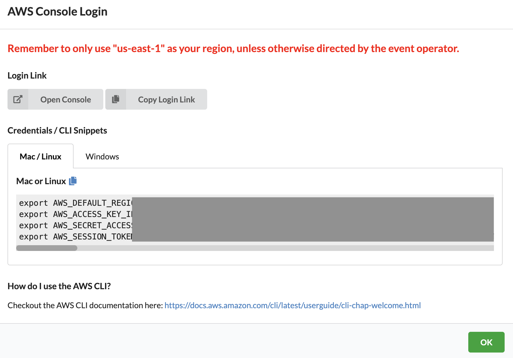

# Complex Reasoning with ReAct using Langchain Agents and Amazon Bedrock

In this workshop, you will learn how to use multiple different techniques and models to build a ReAct based framework. ReAct is an approach to problem solving with large language models based on 2 main premises: Reasoning and Action. With ReAct, you combine reasoning, through chain-of-thought, with the ability to perform actions through a set of tools. This enables the model to (Re)ason through the input request to determine what steps need to be performed, and uses the available tools to perform (ACT)ions as part of a step-by-step resolution.

More details on ReAct can be found in this research paper: [ReAct: Synergizing Reasoning and Acting in Language Models](https://arxiv.org/abs/2210.03629) and the [Google AI Blog](https://blog.research.google/2022/11/react-synergizing-reasoning-and-acting.html)

## Workshop Environment Setup

Before beginning, you'll need to open your lab account, go into Amazon SageMaker Studio, then clone the github repo that will be used for the remainder of the workshop.   

Please follow the detailed steps below to access your workshop AWS account:

1. To access your lab environment, log in to bit.ly link your instructor provided

2. Do not update anything in the screen below and click **Accept Terms & Login** 

3. Choose **Email One-Time Password (OTP)** to sign in 


4. Enter an e-mail address for an inbox you have access to.  A one-time password will be sent to this e-mail address.  Click **Send passcode**


5. Check e-mail to retrieve your one-time passcode, enter your passcode press **Enter**. 

6. You should now see the screen below, click **AWS Console**


7. Click **Open Console**





Please follow the detailed steps below to access Amazon SageMaker Studio: 

1. From the AWS console, search for and click on **Amazon SageMaker** 


2. From the Amazon SageMaker console, select **Studio** on the left-hand menu


3. Click **Open Studio** using the pre-populated default user as shown below. 


Clone the github repository that will be used for the workshop: 

1. From inside SageMaker Studio, open a terminal environment by going to **File** > **New** > **Terminal**


2. From the terminal, clone the github repo by copying and pasting the command below inside the terminal session

```git clone https://github.com/giuseppe-zappia/complex-reasoning-with-react-and-langchain ```


3. You'll now see the cloned github repository on the left hand pane of your Studio environment.  Double-click the folder **complex-reasoning-with-react-and-langchain**


4. Double-click the notebook called **ReAct-bedrock.ipynb**.   The rest of the workshop will be performed in your notebook.  Make sure you set the kernel environment as noted at the beginning of th notebook. 

# HAPPY BUILDING!!


